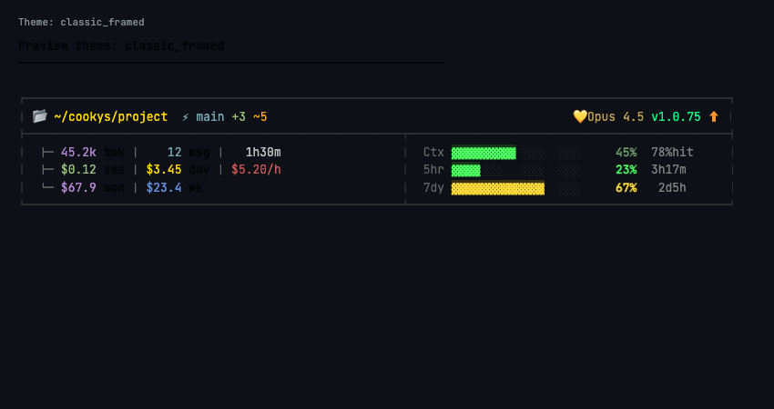

# Claude Statusline

[](https://github.com/kevinlincg/claude-statusline/actions/workflows/ci.yml)
[](https://github.com/kevinlincg/claude-statusline/actions/workflows/release.yml)
[](https://goreportcard.com/report/github.com/kevinlincg/claude-statusline)
[](https://pkg.go.dev/github.com/kevinlincg/claude-statusline)
[](https://github.com/kevinlincg/claude-statusline/releases/latest)
[](https://opensource.org/licenses/MIT)
[](https://slsa.dev)

[English](README.md) | [繁體中文](README.zh-TW.md) | [简体中文](README.zh-CN.md) | [日本語](README.ja.md)

為 Claude Code 打造的自訂狀態列，使用 Go 語言編寫。顯示模型資訊、Git 狀態、API 使用量、Token 消耗、成本指標等。

<p align="center">
  
</p>

## 安裝

### 方式一：下載執行檔（推薦）

從 [GitHub Releases](https://github.com/kevinlincg/claude-statusline/releases/latest) 下載適合您平台的版本：

```bash
# macOS (Apple Silicon)
curl -L https://github.com/kevinlincg/claude-statusline/releases/latest/download/claude-statusline_darwin_arm64.tar.gz | tar xz
mv statusline ~/.claude/statusline-go/

# macOS (Intel)
curl -L https://github.com/kevinlincg/claude-statusline/releases/latest/download/claude-statusline_darwin_amd64.tar.gz | tar xz
mv statusline ~/.claude/statusline-go/

# Linux (x64)
curl -L https://github.com/kevinlincg/claude-statusline/releases/latest/download/claude-statusline_linux_amd64.tar.gz | tar xz
mv statusline ~/.claude/statusline-go/

# Linux (ARM64)
curl -L https://github.com/kevinlincg/claude-statusline/releases/latest/download/claude-statusline_linux_arm64.tar.gz | tar xz
mv statusline ~/.claude/statusline-go/
```

### 方式二：從原始碼編譯

```bash
# 複製專案
git clone https://github.com/kevinlincg/claude-statusline.git ~/.claude/statusline-go

# 編譯
cd ~/.claude/statusline-go
go build -o statusline .
```

### 設定 Claude Code

編輯 `~/.claude/settings.json`：

```json
{
  "statusLine": {
    "type": "command",
    "command": "~/.claude/statusline-go/statusline"
  }
}
```

## 主題

### 互動式主題選擇器

使用互動式選單預覽並選擇主題：

```bash
./statusline --menu
```

使用方向鍵（或 h/l）瀏覽主題，Enter 確認，q 取消。

### 命令列選項

```bash
./statusline --list-themes      # 列出所有主題
./statusline --preview <name>   # 預覽特定主題
./statusline --set-theme <name> # 直接設定主題
./statusline --menu             # 互動式主題選擇器
./statusline --version          # 顯示版本資訊
```

### 手動設定

編輯 `~/.claude/statusline-go/config.json`：

```json
{
  "theme": "classic_framed"
}
```

### 可用主題

目前提供 **65 種主題**：

| 分類 | 主題 |
|------|------|
| 經典 & 簡約 | `classic`, `classic_framed`, `minimal`, `compact`, `boxed`, `zen` |
| 科幻 & 賽博龐克 | `hud`, `cyberpunk`, `synthwave`, `matrix`, `glitch` |
| 自然 & 美學 | `ocean`, `steampunk` |
| 系統監視器 | `htop`, `btop`, `gtop`, `stui` |
| 復古 & 遊戲 | `pixel`, `retro_crt`, `bbs`, `lord`, `tradewars`, `nethack`, `dungeon`, `mud_rpg` |

**[查看所有主題截圖 →](THEMES.zh-TW.md)**

## 顯示資訊

### 第一行：基本資訊
- **模型**：目前使用的 Claude 模型（Opus/Sonnet/Haiku）
- **專案**：目前工作目錄名稱
- **Git 分支**：分支名稱與狀態（+已暫存/~未暫存）
- **Context**：Context Window 使用量進度條
- **每日工時**：今日累積工作時間

### 第二行：API 限制
- **Session**：5 小時內 API 使用率與重置時間
- **Week**：7 天內 API 使用率與重置時間

進度條顏色：綠色 (<50%) → 黃色 (50-75%) → 橘色 (75-90%) → 紅色 (>90%)

### 第三行：Session 統計
- **Token**：本次 Session 累積使用的 Token 數量
- **成本**：本次 Session 的預估成本 (USD)
- **時長**：Session 持續時間
- **訊息數**：對話訊息數量
- **燒錢速度**：每小時花費
- **今日/週成本**：累積成本
- **Cache 命中率**：Cache read 比例（綠色 ≥70% / 黃色 40-70% / 橘色 <40%）

## 定價

每百萬 Token（2026 年 1 月）：

| 模型 | 輸入 | 輸出 | Cache 讀取 | Cache 寫入 |
|------|------|------|------------|------------|
| Opus 4.5 | $5 | $25 | $0.50 | $6.25 |
| Sonnet 4/4.5 | $3 | $15 | $0.30 | $3.75 |
| Haiku 4.5 | $1 | $5 | $0.10 | $1.25 |

## 資料儲存

統計資料儲存於 `~/.claude/session-tracker/`：
- `sessions/` - 個別 Session 資料
- `stats/` - 每日與每週 Token 統計

## 貢獻

歡迎貢獻！請參閱 [CONTRIBUTING.md](CONTRIBUTING.md) 了解貢獻指南。

## 安全性

發布的檔案皆經過簽署並包含 SLSA 來源證明。請參閱 [SECURITY.md](SECURITY.md) 了解驗證方式。

## 授權

[MIT License](LICENSE)
